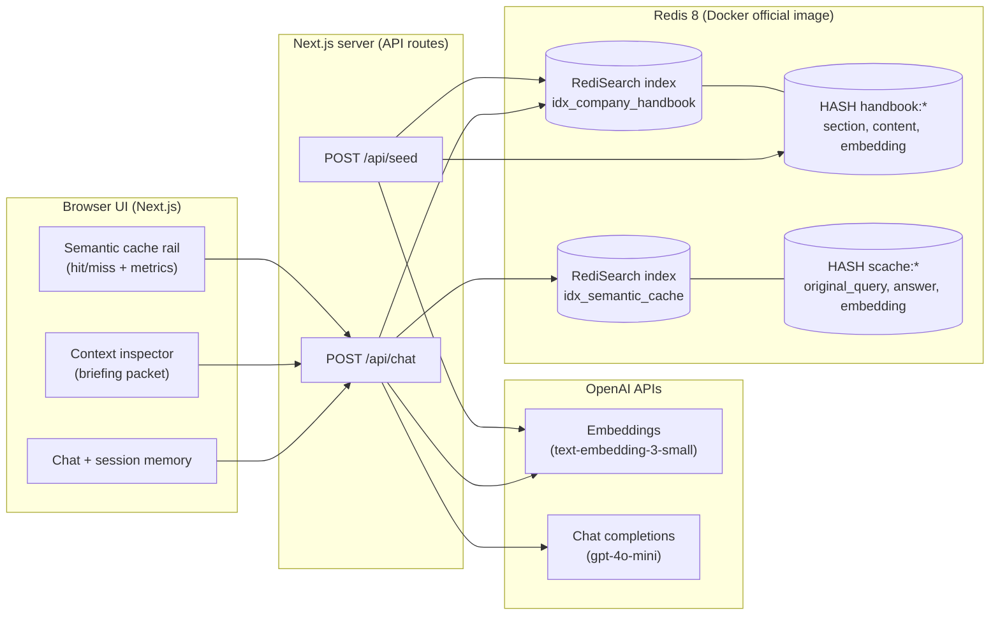
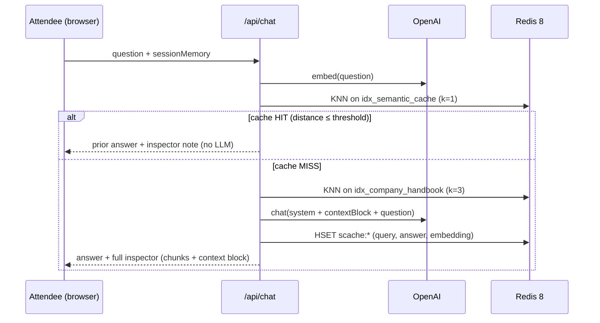
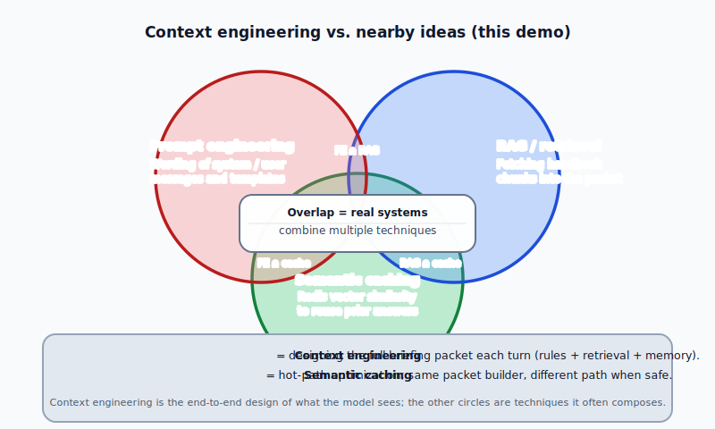

# Company Leaves: Context Engineering and Semantic Caching (Redis 8 and Next.js)

This repository is a **small, runnable application** that shows how **retrieval augmented generation** and a **semantic cache** can work together on top of **Redis 8** (official Docker image), **RediSearch** vector indexes, **Next.js**, and **OpenAI** APIs. The UI has three parts: **chat**, a **context inspector** that shows the text bundle sent to the model on each turn, and a **semantic cache** panel that reports hits and misses plus simple counters.

**Context engineering** is the practice of deciding what the model should read before it answers. For each request you assemble a structured bundle: **system instructions**, **facts pulled from your own content**, and optional **session memory**. That bundle is often called a **briefing packet**. Designing it well constrains answers, improves grounding, and reduces hallucination relative to the sources you trust.

**Semantic caching** reuses prior work when a new user message is **close in meaning** to one you already answered. This app embeds each question, stores vectors and answers in Redis, and runs a **nearest neighbor** search on each turn. If the best match is within a **cosine distance** threshold, the stored answer is returned and the **chat completion** step is skipped, which cuts latency and cost when many questions share the same intent.

> **Context engineering** here means building the right **briefing packet** on every turn. It includes **rules**, **retrieved facts**, and **memory**, so the model has the right information and boundaries before it speaks. In this project, the **inspector** is that packet made visible. **Chat** shows the outcome after the packet has been assembled.

This codebase is a **compact reference implementation** for learning and demonstration.

**Made by Rahul Choubey.** The running app shows the same credit in the page footer. API responses include an `X-Demo-Credit` HTTP header. Please keep this attribution when you fork or republish, unless you have separate written permission from the author.

---

## What this demo illustrates

1. **Context engineering.** For each question, the UI shows the **system preamble**, **session memory**, and the **k** most relevant handbook excerpts from **vector search** (the constructed context).
2. **Retrieval augmented generation.** Handbook chunks live in Redis as **HASH** documents with **TEXT** fields and a **VECTOR** embedding field, indexed by **RediSearch**.
3. **Semantic caching.** Each answered question stores **`original_query`**, **`answer`**, and the query **embedding** in Redis. A new question is **embedded**, then **nearest neighbor** search runs against the cache index. If cosine **distance ≤ threshold**, the app **reuses the prior answer** (no retrieval, no LLM call for that turn).
4. **Redis for AI.** One datastore for **vector retrieval**, **vector cache**, and **low latency** reads on the hot path.

---

## Reference architecture



### End-to-end request flow (one turn)



### What happens in one turn

1. **Browser to API.** The UI sends the user’s question and the current **session memory** string to `POST /api/chat`.
2. **Embed the question.** The server calls OpenAI **embeddings** so the question becomes a vector comparable to Redis-stored vectors.
3. **Semantic cache lookup.** The server runs a **KNN** search on the Redis index **`idx_semantic_cache`** (nearest prior **question embedding**).
4. **Cache HIT.** If the best match’s **cosine distance** is **≤ `SEMANTIC_CACHE_MAX_DISTANCE`**, the server returns the **stored answer**. No handbook retrieval and **no chat completion** run for that turn. The inspector reflects a cache-driven path.
5. **Cache MISS.** The server runs **KNN** on **`idx_company_handbook`** to fetch the **k** handbook chunks that are closest in vector space, **builds the briefing packet** (system rules, session memory, and excerpts), calls **OpenAI chat**, then **writes** a new **`scache:*`** hash (`original_query`, `answer`, `embedding`) so a later question with similar meaning can hit the cache.

---

## Venn diagram for context engineering in this demo

The diagram file for GitHub rendering is here:



**How to read it**

- **Prompt engineering.** Crafting the *wording* of instructions (one part of what you ship).
- **Retrieval.** Fetching *grounding excerpts* into the packet.
- **Semantic caching.** Avoiding repeat **LLM** work when a **similar** question was already answered (stored in Redis).
- **Context engineering in this demo.** The **full briefing packet** you assemble each turn: **system rules**, **retrieved chunks**, and **session memory** (and in larger systems, tool outputs). The app combines prompt and retrieval ideas. **Semantic caching** is a separate **optimization** on the execution path.

---

## Prerequisites

- **Docker Desktop** (running)
- **Node.js 20+** recommended
- **OpenAI API key** (embeddings + chat)

---

## Quick start

```bash
cd company-leaves
docker compose up -d
cp .env.example .env
# Edit .env and set OPENAI_API_KEY

npm install
npm run dev
```

Open [http://localhost:3000](http://localhost:3000), click **Seed Redis**, then start asking questions.

Sample question sequences for hands-on practice (including embedding-safe paraphrases): [docs/demo-query-sets.md](docs/demo-query-sets.md).

Plain-language definitions for the **OpenAI tokens** table in the UI: [docs/openai-token-columns.md](docs/openai-token-columns.md). **Short question → smaller numbers; long question → bigger numbers.** Embeddings for **Seed Redis** (handbook) are separate and are not included in that session table.

### One-liner seed (optional)

```bash
curl -s -X POST http://localhost:3000/api/seed \
  -H 'Content-Type: application/json' \
  -d '{}' | jq .
```

Full reset (drops indexed documents via `FT.DROPINDEX ... DD`):

```bash
curl -s -X POST http://localhost:3000/api/seed \
  -H 'Content-Type: application/json' \
  -d '{"reset": true}' | jq .
```

---

## Configuration

| Variable | Purpose |
|----------|---------|
| `REDIS_URL` | Redis connection string (default matches Compose) |
| `OPENAI_API_KEY` | Required for embeddings, chat, and seeding |
| `OPENAI_EMBEDDING_MODEL` | Default `text-embedding-3-small` (1536 dimensions) |
| `OPENAI_CHAT_MODEL` | Default `gpt-4o-mini` |
| `SEMANTIC_CACHE_MAX_DISTANCE` | Max **cosine distance** for a cache **HIT** (lower = stricter) |

---

## Project layout

```
company-leaves/
  docker-compose.yml      # redis:8 official image
  src/
    app/
      page.tsx            # Three-panel UI
      api/chat/route.ts   # Chat + cache + RAG orchestration
      api/seed/route.ts   # Index + handbook seeding
    lib/
      handbook.ts         # Fictional handbook chunks
      chat-pipeline.ts    # Core flow
      redis-search.ts     # FT.CREATE / FT.SEARCH KNN helpers
  docs/
    context-engineering-venn.svg
    demo-query-sets.md        # Step-by-step query flows + embedding-safe cache hits
    openai-token-columns.md   # Token table columns (plain language)
```

---

## Demo query scripts

Step-by-step chat sequences (tested with this app) for local practice are in **[docs/demo-query-sets.md](docs/demo-query-sets.md)**.

---

## License

**All rights reserved.**

This repository (source code, documentation, diagrams, and other materials) is published for **visibility and educational reference** only. **No license is granted** to copy, modify, merge, publish, distribute, sublicense, sell, or otherwise use this work for any purpose **without prior written permission** from the copyright holder. That restriction applies **in whole and in part**.

That includes using this project as a **template** for products, services, coursework packaging, or **training data** without explicit authorization. **Third-party dependencies** (for example OpenAI, Next.js, Redis, npm packages) remain under **their own** licenses. This notice does not override those upstream terms.

Handbook text and UI copy are **fictional** and **not** intended as legal, HR, or compliance guidance. For permission to reuse or adapt this repository, **contact the maintainer**.
